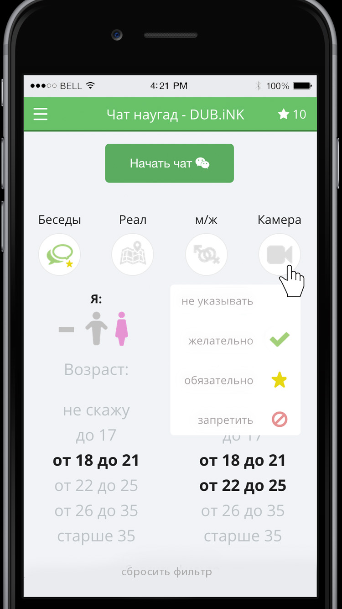

# Random chat



# Development

## Run

```
npm i
npm start
````
Goto http://localhost:8080/

## Deploy isolated dev-environment with Vagrant

1. Setup vagrant: https://www.vagrantup.com/downloads
1. Setup virtualbox: https://www.virtualbox.org/wiki/Downloads
1. Then run: `vagrant_initialize.sh`
1. Enter to virtual machine: `start_vagrant.sh`

